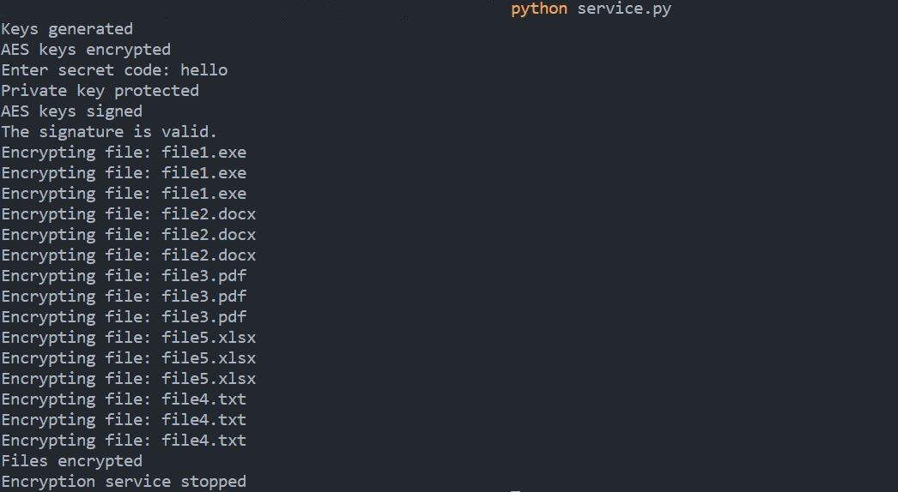

# Directory Encryption
---
Directory Encryption is a simple Python script that allows you to encrypt and decrypt directories using the Advanced Encryption Standard (AES) algorithm. It is designed to be easy to use and flexible, allowing you to encrypt directories of any size and complexity.

## Requirements
Directory Encryption requires Python 3, pyYAML and the PyCryptodome library to be installed on your system.
to install the requirements, run the file ***install_requirements.py***(This assumes that you already have python installed on your system)

## Usage
To use Directory Encryption, simply download the script and run it with Python:`python serivice.py`

You will be prompted to enter a password to use for the encryption/decryption process.

### Example

## Security
Directory Encryption uses the AES algorithm with a 128-bit key to encrypt and decrypt directories. The password you provide is hashed using the MD5 algorithm and used as the key for the AES algorithm. This means that the password you provide is never stored in plain text, and the encryption process is secure.

### Contributing
If you would like to contribute to Directory Encryption, please submit a pull request. We welcome bug fixes, feature requests, and other improvements.

### License
Directory Encryption is licensed under the MIT License. See LICENSE for more information.